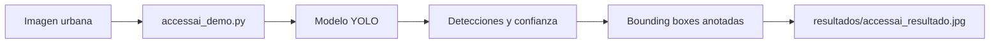
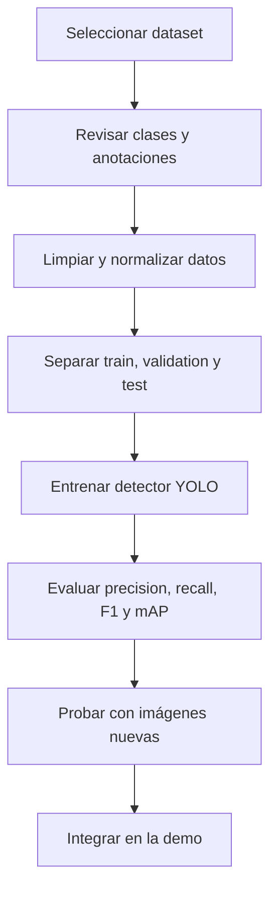

# AccessAI: AI-Based Urban Accessibility Detection

AccessAI es un prototipo de visión artificial desarrollado para detectar elementos relacionados con la accesibilidad urbana en imágenes de entornos peatonales. El repositorio incluye una demo funcional basada en YOLO y un conjunto de recursos de apoyo para presentación y documentación del proyecto.

> Estado verificado: la demo existe y funciona como flujo técnico inicial, pero aún no hay un dataset propio ni un modelo entrenado específicamente para accesibilidad urbana. Todo el avance real del proyecto debe entenderse como base técnica, no como validación final del problema.

## 1. Motivación

Los mapas suelen indicar que una zona es transitable, pero una persona con movilidad reducida puede enfrentarse a barreras reales como bordillos elevados, ausencia de rampas, objetos que bloquean el paso o superficies deterioradas. La accesibilidad urbana no es solo una cuestión de infraestructura visible en un plano, sino una condición comprobable en el entorno real.

AccessAI estudia cómo utilizar visión artificial para convertir imágenes urbanas en información estructurada y útil para la accesibilidad peatonal. A largo plazo, estas detecciones podrían integrarse con información geográfica para construir mapas de accesibilidad más útiles y actualizados.

## 2. Problema que aborda el proyecto

El problema central consiste en detectar y localizar elementos urbanos relevantes para la accesibilidad, especialmente en contextos peatonales. Esto incluye elementos como:

- aceras,
- rampas de acceso,
- posibles obstáculos,
- cambios de nivel,
- superficies con riesgo de obstrucción o inseguridad.

La solución inicial se centra en una demo técnica y un pipeline de detección visual, con un enfoque claro en clases concretas antes de ampliar el alcance a otras barreras.

## 3. Objetivo principal

Desarrollar un sistema capaz de analizar imágenes de entornos peatonales y localizar elementos relacionados con la accesibilidad urbana.

### Objetivos iniciales

1. Revisar datasets públicos de imágenes urbanas y accesibilidad.
2. Identificar las clases más útiles para el problema, inicialmente `sidewalk` y `curbramp`.
3. Preparar anotaciones para entrenamiento, validación y prueba.
4. Entrenar y evaluar un detector de objetos específico.
5. Mostrar detecciones sobre la imagen original con bounding boxes.

### Posibles ampliaciones

- Obstáculos en aceras.
- Escaleras y cambios de nivel.
- Bordillos sin rebaje.
- Superficies deterioradas.
- Integración con coordenadas GPS.
- Aplicación o mapa orientado a personas con movilidad reducida.

## 4. Alcance real del proyecto

### Alcance actual

Este proyecto en la fase actual debe centrarse en:

- la elección de un único dataset relevante,
- la preparación de anotaciones en formato compatible con YOLO,
- la definición de dos clases objetivo claras,
- el entrenamiento inicial de un modelo de detección,
- la validación técnica e interpretación de resultados,
- la integración del modelo entrenado en la demo existente.

### No incluido en esta fase

- sistema completo de mapas,
- geolocalización o coordenadas GPS,
- aplicación web completa,
- base de datos operativa,
- infraestructura de producción,
- combinación de varios datasets con anotaciones distintas.

## 5. Estado verificado del repositorio

### Evidencia disponible

- Demo de detección basada en YOLO: `accessai_demo.py`
- Generadores de presentación: `generate_accessai_pptx.py`, `generate_accessai_pptx_v2_0_2.py`
- Documentación de contexto: `README.md`
- Recursos de estilo y presentación: `Theme3.thmx`, `inspect_theme.py`
- Plantillas del curso: action plan y plantilla final

### Lo que todavía no está implementado de forma verificada

- dataset propio de accesibilidad urbana integrado en el repositorio,
- entrenamiento real del modelo para `sidewalk` y `curbramp`,
- pesos y métricas verificables del modelo entrenado,
- interfaz más allá de la demo por línea de comandos,
- mapa geográfico o componente GPS,
- validación real del problema con imágenes y anotaciones dedicadas.

### Estado real del modelo actual

El modelo que aparece en la documentación es `yolov8n.pt`, un modelo de detección general preentrenado. La documentación del proyecto indica explícitamente que no está entrenado para accesibilidad urbana. Por tanto, la demo actual es una base técnica para demostrar flujo de inferencia, no una prueba de rendimiento del problema real.

## 6. Arquitectura del prototipo



El flujo actual es el siguiente:

1. Se recibe una imagen mediante `--image`.
2. Se carga el modelo indicado mediante `--model`.
3. YOLO genera las detecciones con el umbral `--conf`.
4. El script imprime la clase, la confianza y las coordenadas de cada detección.
5. La imagen anotada se guarda en la ruta indicada mediante `--output`.

## 7. Datos y fuentes candidatas

La documentación del proyecto menciona como candidatos principales:

- Project Sidewalk
- Sidewalk Accessibility
- Cityscapes

La decisión de la fase actual exige trabajar con un único dataset, sin mezclar varias fuentes ni acumular duplicidades. La elección debe priorizar:

- disponibilidad de anotaciones relevantes,
- compatibilidad con `sidewalk` y `curbramp`,
- calidad de las imágenes,
- distribución de ejemplos por clase,
- posibilidad de convertirlas al formato YOLO.

## 8. Requisitos técnicos

- Windows, macOS o Linux.
- Python 3.10 o superior.
- Entorno virtual recomendado.
- Dependencias mínimas:
  - `ultralytics`
  - `opencv-python`
  - `python-pptx`

## 9. Instalación

Desde la carpeta raíz del proyecto:

```powershell
python -m venv .venv
.\.venv\Scripts\Activate.ps1
python -m pip install --upgrade pip
python -m pip install ultralytics python-pptx
```

Si PowerShell bloquea la activación del entorno:

```powershell
Set-ExecutionPolicy -Scope Process -ExecutionPolicy RemoteSigned
.\.venv\Scripts\Activate.ps1
```

## 10. Uso de la demo

### Ejecución mínima

```powershell
python accessai_demo.py --image "datos\acera.jpg"
```

### Ejecución con parámetros personalizados

```powershell
python accessai_demo.py `
  --image "datos\acera.jpg" `
  --model "modelos\accessai.pt" `
  --conf 0.40 `
  --output "resultados\acera_anotada.jpg"
```

### Opciones disponibles

| Opción | Obligatoria | Predeterminado | Descripción |
|---|---:|---|---|
| `--image` | Sí | Sin valor | Ruta a la imagen de entrada. |
| `--model` | No | `yolov8n.pt` | Ruta al modelo YOLO en formato `.pt`. |
| `--conf` | No | `0.25` | Umbral de confianza. |
| `--output` | No | `resultados/accessai_resultado.jpg` | Ruta de salida para la imagen anotada. |

## 11. Interpretación de resultados

La consola muestra una línea por detección con:

- clase detectada,
- confianza,
- bounding box en formato `[x1, y1, x2, y2]`.

La imagen anotada se guarda automáticamente; si la carpeta de salida no existe, se crea.

Con el modelo actual, las detecciones no deben interpretarse como indicadores reales de accesibilidad urbana, porque el modelo base no ha sido entrenado para ese problema específico.

## 12. Metodología prevista



La estrategia recomendada es:

1. elegir un dataset único,
2. preparar datos y etiquetas,
3. definir las clases objetivo exactas,
4. entrenar un primer modelo YOLO,
5. evaluar con métricas de detección,
6. reemplazar el modelo genérico por el modelo entrenado,
7. documentar resultados de forma honesta y verificable.

## 13. Estructura del proyecto

```text
.
|-- accessai_demo.py
|-- generate_accessai_pptx.py
|-- generate_accessai_pptx_v2_0_2.py
|-- inspect_theme.py
|-- Theme3.thmx
|-- PLAN.md
|-- README.md
|-- SIC_AI_Capstone Project_Action Plan(6).md
|-- SIC_AI_Capstone Project_Final Report(11).md
|-- resultados/                 # Se crea al ejecutar la demo
|-- .venv/                      # Entorno local, no versionado
`-- ...
```

## 14. Limitaciones y próximos pasos

### Limitaciones actuales

- No existe un dataset específico de AccessAI integrado en el repositorio.
- `yolov8n.pt` es un modelo general y no está entrenado para las clases finas del proyecto.
- La demo procesa una imagen a la vez.
- No hay métricas de entrenamiento ni validación real publicadas.
- El sistema aún no tiene información geográfica ni funciones de mapeado.

### Próximos pasos técnicos

1. Seleccionar y documentar un único dataset definitivo.
2. Preparar anotaciones en formato YOLO.
3. Crear configuraciones para `train`, `val` y `test`.
4. Entrenar un modelo específico para accesibilidad urbana.
5. Medir precision, recall, F1 y mAP por clase.
6. Revisar falsos positivos y negativos.
7. Sustituir `yolov8n.pt` por el modelo entrenado.
8. Añadir mejoras de robustez y usabilidad.
9. Considerar la integración con información geográfica.

## 15. Solución de problemas

### `ModuleNotFoundError: No module named 'ultralytics'`

```powershell
.\.venv\Scripts\Activate.ps1
python -m pip install ultralytics
```

### No se encuentra la imagen

```powershell
python accessai_demo.py --image "C:\proyectos\accessai\datos\acera.jpg"
```

### No se guarda la imagen de salida

Comprueba los permisos de escritura y que la ruta indicada existe o puede crearse.

### No hay detecciones

Prueba un umbral más bajo, por ejemplo:

```powershell
python accessai_demo.py --image "datos\acera.jpg" --conf 0.15
```

Esto puede aumentar los falsos positivos, pero no reemplaza el entrenamiento específico para el problema.

## 16. Documentación relacionada

- [PLAN.md](PLAN.md)
- [SIC_AI_Capstone Project_Action Plan(6).md](SIC_AI_Capstone%20Project_Action%20Plan(6).md)
- [SIC_AI_Capstone Project_Final Report(11).md](SIC_AI_Capstone%20Project_Final%20Report(11).md)
- [accessai_demo.py](accessai_demo.py)
- [generate_accessai_pptx_v2_0_2.py](generate_accessai_pptx_v2_0_2.py)

## 17. Nota final

Este proyecto tiene una base sólida para demostrar el flujo técnico de detección visual, pero su avance real requiere trabajar en datos específicos y entrenamiento supervisado para las clases de accesibilidad urbana. La documentación refleja lo que está realmente apoyado por evidencia, sin inventar resultados ni sobreestimar el alcance actual.

